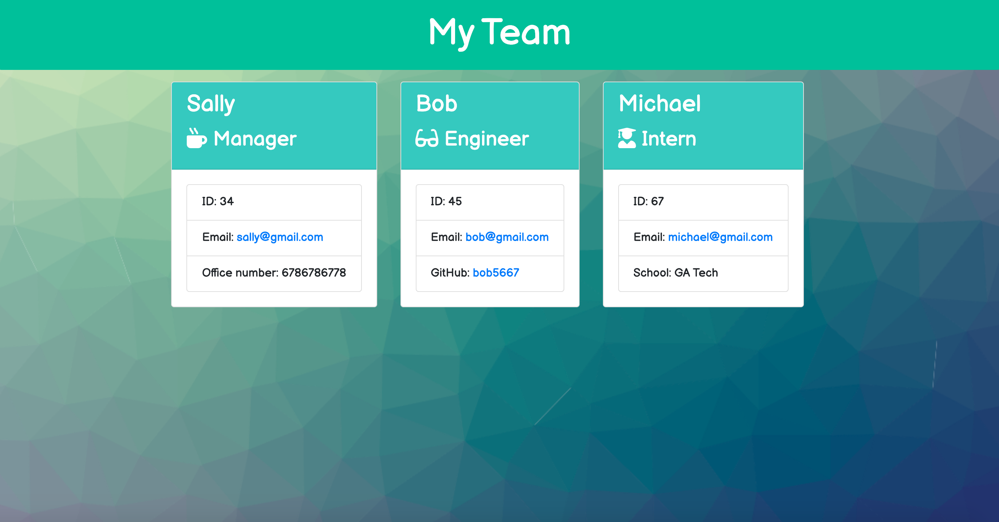
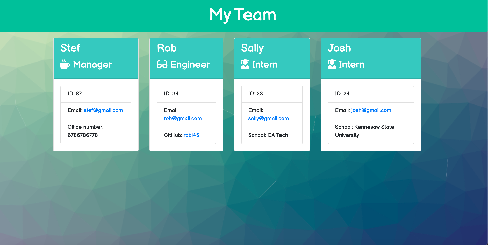

# Employee-Info

 

# Description 

 For this assignment we were to create a Node CLI that takes in information about employees and generates an HTML website that displays summaries for each person. We also needed to pass some failed tests by reading the errors on the terminal as well as on the test.js files. This is important as a developer, so you make code maintainable. 
As a manager I want to generate a website that display’s my team’s basic information so that I can have quick access to GitHub and emails. 

## Table of Content

* [Installation](#installation)
* [Usage](#usage)
* [Credits](#credits)
* [License](#license)

## Installation

* Created a git repository
* Ran npm init, npm install, npm run test.  
* Created CSS

## Usage

* Node.js
* Variable Created (specifically CONST)
* Arrays
* Prompts
* Function Calls
* File Systems

## Credits

Created by myself as a homework assignment for Georgia Tech Full-Stack Flex Program.

## License

MIT License

Copyright (c) [2020] [Estefania Lupo]

Permission is hereby granted, free of charge, to any person obtaining a copy
of this software and associated documentation files (the "Software"), to deal
in the Software without restriction, including without limitation the rights
to use, copy, modify, merge, publish, distribute, sublicense, and/or sell
copies of the Software, and to permit persons to whom the Software is
furnished to do so, subject to the following conditions:

The above copyright notice and this permission notice shall be included in all
copies or substantial portions of the Software.

THE SOFTWARE IS PROVIDED "AS IS", WITHOUT WARRANTY OF ANY KIND, EXPRESS OR
IMPLIED, INCLUDING BUT NOT LIMITED TO THE WARRANTIES OF MERCHANTABILITY,
FITNESS FOR A PARTICULAR PURPOSE AND NONINFRINGEMENT. IN NO EVENT SHALL THE
AUTHORS OR COPYRIGHT HOLDERS BE LIABLE FOR ANY CLAIM, DAMAGES OR OTHER
LIABILITY, WHETHER IN AN ACTION OF CONTRACT, TORT OR OTHERWISE, ARISING FROM,
OUT OF OR IN CONNECTION WITH THE SOFTWARE OR THE USE OR OTHER DEALINGS IN THE
SOFTWARE.

